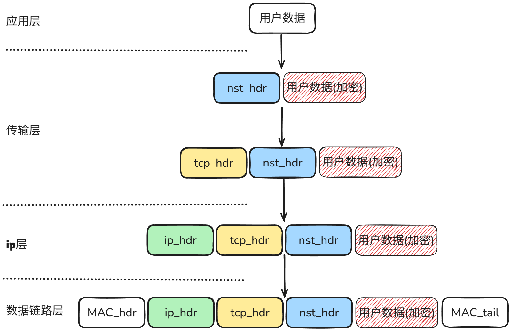

# 自定义传输层协议NST
- 协议复用点
  - 复用tcp_prot、udp_prot
  - 复用inet_stream_ops、inet_dgram_ops
- 协议修改点
  - 在tcp_sendmsg、udp_sendmsg前修改和加密数据
  - 在tcp_sendmsg、udp_recvmsg还原数据
- 有关netfilter
  - 在LOCAL_IN阶段进行检查
- 使用协议需要**用户层代码改变**
  - 用户层代码创建socket时指定NST协议
  - TCP:```socket(AF_NST, NST_SOCK_STREAM, 0)```
  - UDP:```socket(AF_NST, NST_SOCK_DGRAM, 0)```
- 待考证的细节
  - tcp握手是否独立于tcp_sendmsg、tcp_recv
  - 是否需要修改sendpage
  - msghdr如何进行修改和加密

## 整体流程


## 头部设计
``` c
// 4+1+1+2+8+8+16+1+1+2+4 = 48(B)
struct nst_hdr {
    __be32 magic;                   // 魔数标识协议
    u8 version;                     // 协议版本
    u8 cipher_id;                   // 加密算法ID
    __be16 transport_len;             // 明文 payload 长度
    __be64 timestamp;               // 时间戳，防重放
    __be64 nonce;                   // 随机数/计数器
    u8 token[NST_TOKEN_LEN];        // 认证字段（对称或HMAC）
    u8 kpos;                    // 秘钥改变位置, 0表示不修改
    u8 kval;                    // 秘钥改变值
    __be16 kid;                     // 秘钥id
    __be32 flags;                   // 保留标志位
} __attribute__((packed));          // 取消结构对齐
```

## 加密算法
```
#define ENCRYPT_ALGO_AES_GCM 1
#define ENCRYPT_ALGO_AES_CBC 2
#define ENCRYPT_ALGO_SM4_GCM 3 // 国密
#define ENCRYPT_ALGO_SM4_CBC 4 // 国密
```
当前思路：采用对称加密算法+静态随机密钥盒+密钥扰动

## 具体待解决问题
1. 如何复用`PF_INET`的TCP/UDP
2. `struct msghdr`如何加密和重构
3. 防重放的结构如何组织，在recv进行还是LOCAL_OUT进行
4. 模块开关
5. 数据还原


# 相似工作调研
## 1. linux官方KTLS
示例：
**用户空间完成tls握手**，并将密钥使用`setsockopt`传输给内核，此后内核将自动加密解密。
``` c
SSL *ssl = SSL_new(ctx);
SSL_set_fd(ssl, sockfd);

// 1. 完成握手（用户态执行）
SSL_connect(ssl);

// 2. 获取加密参数
SSL_export_keying_material(...); // 导出密钥、iv、seq

// 3. 配置内核TLS加密
struct tls12_crypto_info_aes_gcm_128 crypto = { ... };
setsockopt(sockfd, SOL_TLS, TLS_TX, &crypto, sizeof(crypto));

// 4. 发送数据（内核自动加密）
send(sockfd, "Hello", 5, 0);  // KTLS 自动加密发送
```

## 2. AF_KTLS 内核模块

**注意：该实现仍处于高度开发中，使用风险自负！**

该内核模块引入了一种新的套接字协议族：`AF_KTLS`。`AF_KTLS` 套接字可以用于在 **TCP** 上通过 **TLS 1.2** 或在 **UDP** 上通过 **DTLS 1.2** 传输数据。目前，仅支持 **AES GCM** 加密套件。

该套接字仅负责数据传输，而诸如 **握手（handshake）**、**重新握手（re-handshaking）** 以及其他控制信息的处理需要用户空间通过如 **OpenSSL** 或 **GnuTLS** 等库来完成。

AF\_KTLS 套接字在某些场景下传输速度更快，尤其是在无需用户空间干预的数据传输中（例如使用 `sendfile(2)` 或 `splice(2)` 实现的零拷贝传输）。

该套接字基于 **RFC 5288**，该标准最初由 Facebook 的 **Dave Watson** 在 Linux 加密邮件列表中提出。该仓库中包含了 RFC 5288 的最新补丁。

如需了解基准测试场景或评估你自己的用例性能影响，请参阅配套的 **AF\_KTLS 工具**。

可以在项目的 Issues 中查看待实现的功能或已知的 Bug。

推荐同时参考：

* **AF\_KTLS tool（测试工具）**
* **AF\_KTLS visualize（可视化工具）**

### 架构设计
``` 
应用层：   [用户应用程序]
TLS层：    [AF_KTLS 套接字]
传输层：   [TCP/UDP 套接字]
网络层：   [IP 协议栈]
```
流程：
1. 用户应用程序创建TCP/UDP连接， 每一个连接创建一个ktls套接字
2. 用户空间调用openssl_connect进行握手获取密钥，
3. 使用`密钥`和连接`fd`构建sockaddr_ktls， 
4. 并调用tls_bind（sockaddr_ktls）绑定ktls套接字， 
5. bind替换数据就绪/写空间回调